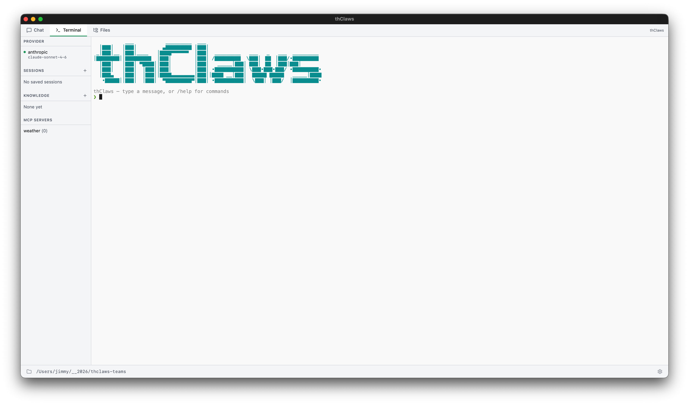
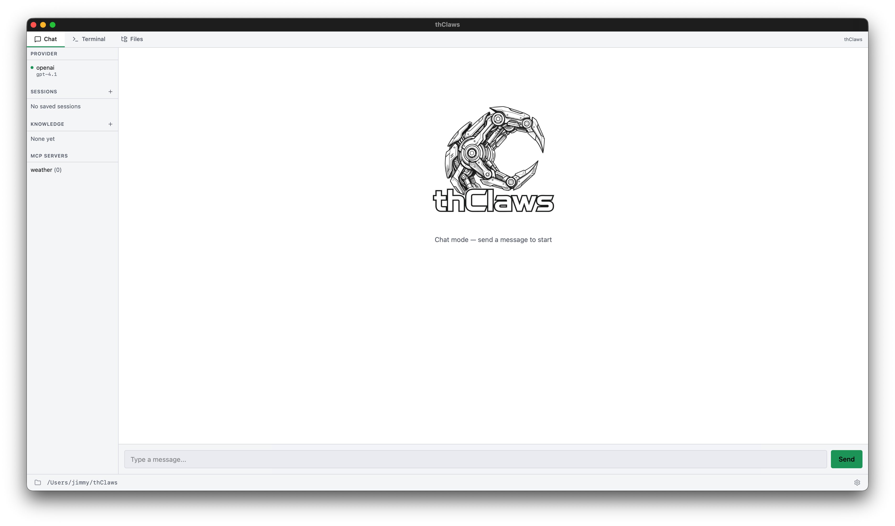

# บทที่ 3 — Working directory และโหมดการรัน

thClaws **ยึดตัวเองไว้กับ directory เดียว** tool ทุกตัวที่เกี่ยวกับไฟล์ —
read, write, edit, glob, grep, bash — จะถูกจำกัดให้อยู่ภายใน directory
นั้นและ descendant ของมันเท่านั้น เลือกให้ดี หากกว้างเกินไป (เช่น `/`)
จะเสียประโยชน์ของ sandbox ไป แต่ถ้าแคบเกินไป agent ก็จะมองไม่เห็นสิ่ง
ที่ต้องใช้

## ตั้งค่าครั้งแรกที่เปิดใช้ {#first-launch-setup}

การเปิด desktop GUI ครั้งแรกจะพาคุณผ่าน modal สองตัวตามลำดับ ก่อน
ปล่อยเข้าสู่หน้าต่างหลัก ส่วนการเปิดครั้งถัด ๆ ไป ระบบจะข้าม modal ตัว
ที่สองให้ เพราะได้จำตัวเลือก keychain / `.env` ของคุณไว้แล้ว

### 1. เลือก working directory

ทุกครั้งที่เปิด (ไม่ใช่แค่ครั้งแรก) จะมี modal ถามว่าอยากให้ thClaws
ยึดรากไว้ที่ไหน โดยช่องจะถูกกรอกล่วงหน้าด้วย `cwd` ปัจจุบัน พร้อม
แสดงสาม directory ล่าสุดที่คุณเคยเลือกไว้


เลือกได้สามวิธี:

1. **พิมพ์ path** ลงในช่องข้อความ
2. รายการทางลัด **Recent directories** (เก็บใน `~/.config/thclaws/recent_dirs.json`)
3. **Browse…** เปิดตัวเลือก folder แบบ native ของ OS (macOS ใช้ `osascript`, Linux ใช้ `zenity`, Windows ใช้ dialog ของ PowerShell)

เลือกอย่างใดอย่างหนึ่งแล้วคลิก **Start** แอปจะตั้งรากของ sandbox แล้ว
spawn PTY ของ REPL ให้

### 2. จะให้ thClaws เก็บ API key ไว้ที่ไหน?

**เฉพาะการเปิดใช้ครั้งแรกเท่านั้น** หลังจากเลือก working directory
เสร็จ จะมี dialog ที่สองขึ้นมาถามว่าอยากเก็บ API key ของ LLM ไว้ที่ไหน
dialog นี้จะรัน *ก่อน* ที่ thClaws จะไปแตะ keychain ของ OS —
ดังนั้นถ้าเลือก `.env` ก็จะไม่มี prompt ของ keychain เด้งขึ้นมาเลย


- **OS keychain (แนะนำ)** — เข้ารหัสและผูกกับ user account ของคุณ
  (macOS Keychain / Windows Credential Manager / Linux Secret
  Service) จะมี prompt ขอสิทธิ์จาก OS โผล่ขึ้นมาครั้งเดียวตอนที่
  thClaws อ่าน key เป็นครั้งแรก คลิก "Always Allow" แล้วการเปิดครั้ง
  ถัดไปจะไม่มีการถามอีก ยกเว้นเมื่อมีการอัพเดทเวอร์ชั่นของโปรแกรม
- **ไฟล์ `.env`** — เก็บ key เป็นข้อความธรรมดาไว้ที่
  `~/.config/thclaws/.env` ไม่มี prompt จาก keychain มารบกวน เหมาะกับ
  เครื่อง Linux แบบ headless ที่ไม่มี Secret Service แต่แลกมาด้วย
  ความเสี่ยงที่ใครก็ตามที่เข้าถึง home directory ของคุณได้
  จะอ่านไฟล์นี้ได้ด้วย

ตัวเลือกของคุณจะถูกบันทึกไว้ที่ `~/.config/thclaws/secrets.json` และ
มีผลถาวร หากเปลี่ยนใจภายหลังก็ทำได้ โดยไปที่ Settings → Provider API
keys → "Change…" ระบบจะเปิด chooser ตัวเดียวกันขึ้นมาอีก ดู
[บทที่ 6](ch06-providers-models-api-keys.md#secrets-backend-chooser)
สำหรับการเปรียบเทียบ trade-off แบบเจาะลึก

### CLI และ `-p` ข้าม modal ของ GUI

โหมด CLI และโหมดไม่โต้ตอบจะไม่แสดง modal — CLI ใช้ directory ที่คุณ
launch มันขึ้นมา ส่วนตัวเลือก backend ของ secret จะอ่านจาก
`~/.config/thclaws/secrets.json` (หรือใช้ค่าเริ่มต้นเป็น `.env` ถ้า
ไฟล์ไม่มีอยู่)

```bash
cd ~/projects/my-app
thclaws --cli
```

## โหมดการรัน

### Desktop GUI (ค่าเริ่มต้น)

```bash
thclaws
```

เปิด desktop app แบบ native ซึ่งมีสามแท็บ (Chat, Terminal, Files,
Team) พร้อม sidebar แสดงส่วน provider/sessions/knowledge/MCP และมี
ไอคอนเฟืองสำหรับ Settings ดู[บทที่ 4](ch04-desktop-gui-tour.md) สำหรับ
ทัวร์ฉบับเต็ม พร้อมภาพหน้าจอและคีย์ลัด

Terminal Tab:


Chat Tab:


### CLI แบบโต้ตอบ

```bash
thclaws --cli
```

agent ตัวเดียวกัน เพียงแต่อยู่ใน terminal ทุกฟีเจอร์ในคู่มือเล่มนี้
ใช้งานได้ที่นี่ — เพราะนี่คือกระดูกสันหลังที่ GUI ห่อหุ้มไว้นั่นเอง


ภายใน REPL บรรทัดที่คุณพิมพ์จะถูกแบ่งออกเป็นสามประเภท:

| Prefix | เกิดอะไรขึ้น |
|---|---|
| `/<name> [args]` | Slash command — มีในตัว หรือเป็น skill / legacy command (ดูบทที่ 10) |
| `! <shell cmd>` | Shell escape — รันใน terminal ของคุณโดยตรง ข้าม agent ทั้งหมด (ไม่เสีย token ไม่ต้อง approve) |
| *อย่างอื่น* | ส่งให้โมเดลในรูปของ user prompt |

Shell escape เหมาะมากสำหรับเช็คอะไรเร็ว ๆ ในระหว่างทำงาน:

```
❯ ! git status
On branch main
nothing to commit, working tree clean
❯ ! ls src
main.rs  lib.rs  config.rs
❯ now add a new module `auth.rs` based on config.rs
[tool: Read: src/config.rs] ✓
...
```

prefix เดียวกันนี้ใช้ได้ในแท็บ Terminal ของ desktop GUI ด้วย

### One-shot `-p` / `--print`

```bash
thclaws -p "What does src/main.rs do?"
thclaws --print "What does src/main.rs do?"    # equivalent long form
```

รันหนึ่ง turn สตรีมคำตอบออกมา แล้วออกจากโปรแกรม มีประโยชน์ใน CI,
git hook หรือ pipeline ของ shell:

```bash
git diff | thclaws -p "summarise this diff for a commit message"
```


### Flag ที่ใช้บ่อย

```
    --cli                    run the CLI REPL instead of the GUI
-p, --print                  non-interactive: run prompt and exit (implies --cli)
-m, --model MODEL            override the model (e.g. claude-sonnet-4-6, ap/gemma4-26b)
    --accept-all             auto-approve every tool call (dangerous — see ch5)
    --permission-mode MODE   auto | ask
    --max-iterations N       max agent loop iterations per turn (0 = unlimited, default 200)
    --resume ID              resume a saved session ("last" for most recent)
    --system-prompt TEXT     override the system prompt entirely
    --allowed-tools LIST     comma-separated tool allowlist
    --disallowed-tools LIST  comma-separated tool denylist
    --verbose                extra diagnostic output
```

## Session

ทุก turn จะถูกบันทึกอัตโนมัติลงไฟล์ `./.thclaws/sessions/<id>.jsonl`
Session จะ **ผูกกับโปรเจกต์** — เมื่อคุณเริ่ม thClaws ใน directory ใหม่
ก็จะเจอรายการ session ที่ยังว่างเปล่า

ดู[บทที่ 7](ch07-sessions.md) สำหรับคำสั่งครบชุด (`/save`, `/load`,
`/rename`, `/sessions`, `--resume`) รูปแบบการเก็บไฟล์บน disk และวิธีที่
session โต้ตอบกับการเปลี่ยน provider / model

## ใน `.thclaws/` มีอะไรบ้าง

root ของ sandbox ยังใช้เก็บ config และ runtime state ระดับโปรเจกต์ด้วย:

```
.thclaws/
├── settings.json     project config (model, permissions, tool lists, kms.active)
├── mcp.json          project MCP servers
├── agents/           agent definitions (*.md)
├── skills/           installed skills
├── commands/         legacy prompt-template slash commands
├── plugins/          installed plugin bundles
├── plugins.json      plugin registry (project scope)
├── prompt/           prompt overrides
├── sessions/         session history — see Chapter 7
├── memory/           MEMORY.md + per-topic memory files — see Chapter 8
├── kms/              project-scope knowledge bases — see Chapter 9
├── rules/            extra *.md rules injected into the system prompt
├── AGENTS.md         project-level agent instructions
└── team/             Agent Teams runtime state — see Chapter 17
```

เช็คพวกนี้เข้า git เพื่อแชร์กับทีมได้ แต่ควรใส่ `.thclaws/sessions/`
และ `.thclaws/team/` ไว้ใน `.gitignore` เพราะทั้งคู่เป็น runtime state

ส่วนของระดับผู้ใช้ทั้งระบบจะอยู่ใต้ `~/.config/thclaws/` (และมี
`~/.claude/` เป็น fallback ของ Claude Code)

### `settings.json` คือปุ่มปรับของ runtime ทุกตัว

runtime toggle ทั้งหมด — permission mode, thinking budget, รายการ tool
ที่อนุญาต/ห้าม, endpoint ของ provider, KMS ที่แนบไว้, `teamEnabled`,
ขนาดหน้าต่าง GUI — อยู่รวมกันในไฟล์ JSON ไฟล์เดียว โหลดตามลำดับ
ความสำคัญ: CLI flag > `.thclaws/settings.json` (ระดับโปรเจกต์ commit
ลง repo ได้) > `~/.config/thclaws/settings.json` (ระดับผู้ใช้ทั้งระบบ)
> `~/.claude/settings.json` (fallback ของ Claude Code) > default ที่
compile มาใน binary

`settings.json` ไม่เก็บ API key — key อยู่ใน OS keychain หรือไฟล์
`.env` ตามที่คุณเลือกตอนเปิดใช้ครั้งแรก (ดูข้างบน)
