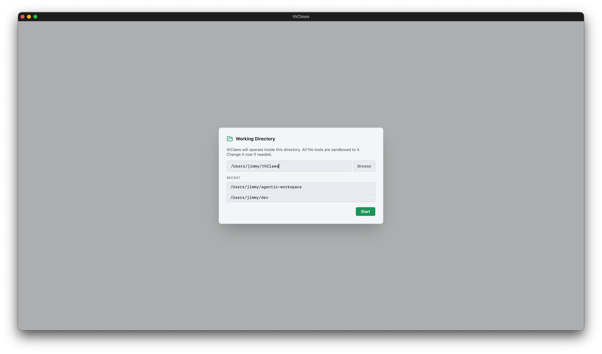
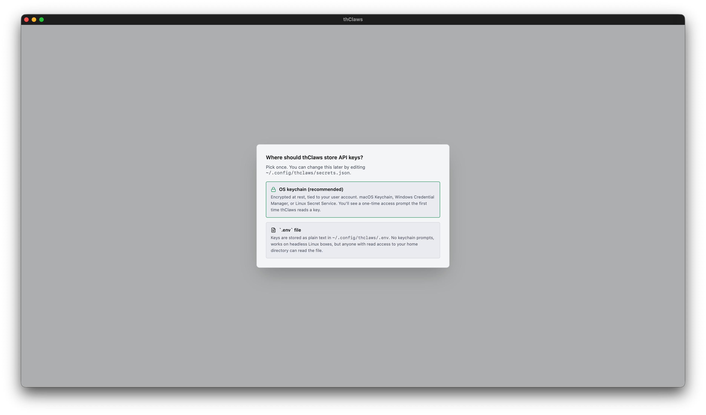
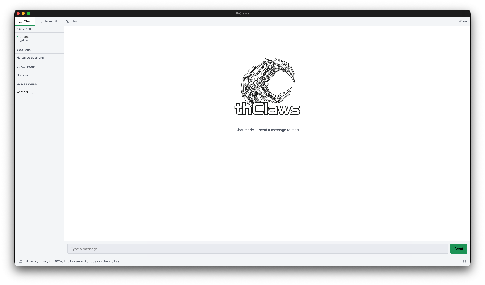
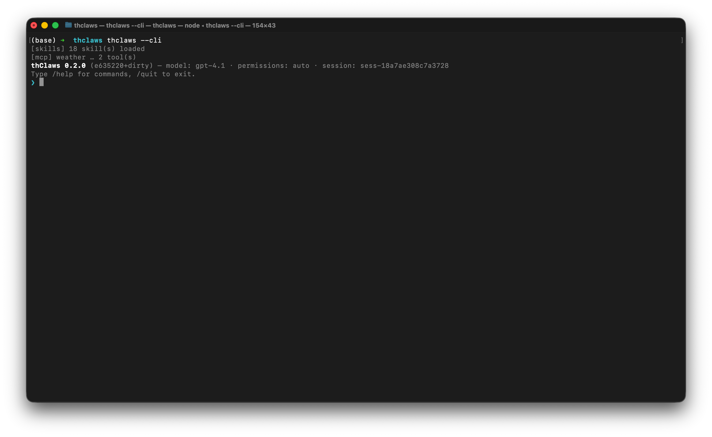
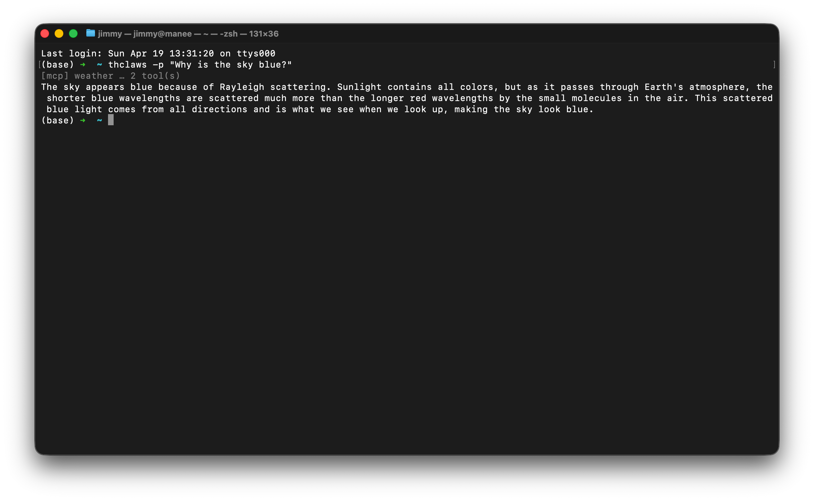

# Chapter 3 — Working directory & running modes

thClaws is **rooted at a directory**. Every file tool — read, write, edit,
glob, grep, bash — is restricted to that directory and its descendants.
Pick it carefully: too broad (like `/`) and you lose the sandbox; too
narrow and the agent can't see what it needs.

## First-launch setup {#first-launch-setup}

Opening the desktop GUI for the first time runs you through two
modals in sequence, then drops you into the main window. Subsequent
launches skip the second modal — your keychain / `.env` choice is
remembered.

### 1. Pick a working directory

Every launch (not just the first) starts with a modal asking where
thClaws should root itself. It's pre-filled with your current `cwd`
and lists the last three directories you picked.



Three ways to pick:

1. **Type the path** into the text field
2. **Recent directories** shortcut list (stored in `~/.config/thclaws/recent_dirs.json`)
3. **Browse…** opens a native OS folder picker (macOS `osascript`, Linux `zenity`, Windows PowerShell dialog)

Pick one and click **Start**; the app sets the sandbox root and
spawns the REPL PTY.

### 2. Where should thClaws store API keys?

**First launch only.** Right after the working-directory pick, a
second dialog asks how your LLM API keys should be stored. This
dialog runs *before* thClaws touches the OS keychain at all — pick
`.env` and no keychain prompt ever fires.



- **OS keychain (recommended)** — encrypted, tied to your user
  account (macOS Keychain / Windows Credential Manager / Linux Secret
  Service). You'll see a one-time OS access prompt the first time
  thClaws reads a key; click "Always Allow" and subsequent launches
  are silent.
- **`.env` file** — plain text at `~/.config/thclaws/.env`. No
  keychain prompts, works on headless Linux boxes that lack Secret
  Service, but anyone with read access to your home directory can
  read the file.

Your choice is saved to `~/.config/thclaws/secrets.json` and
respected forever after. You can change your mind later: Settings →
Provider API keys → "Change…" reopens the same chooser. See
[chapter 6](ch06-providers-models-api-keys.md#secrets-backend-chooser)
for the trade-off in depth.

### CLI and `-p` skip the GUI modals

The CLI and non-interactive modes don't show modals — the CLI uses
whatever directory you launched it from, and the secrets-backend
choice is read from `~/.config/thclaws/secrets.json` (or defaults to
`.env` if the file doesn't exist).

```bash
cd ~/projects/my-app
thclaws --cli
```

## Running modes

### Desktop GUI (default)

```bash
thclaws
```

Opens the native desktop app — four tabs (Terminal, Chat, Files, Team),
a sidebar with provider/sessions/knowledge/MCP sections, and a gear
icon for Settings. [Chapter 4](ch04-desktop-gui-tour.md) is the full
tour with screenshots and keyboard shortcuts.



### Interactive CLI

```bash
thclaws --cli
```

Same agent, just in a terminal. Every feature in this manual works
here — it's the backbone the GUI wraps.



Inside the REPL, lines you type fall into three buckets:

| Prefix | What happens |
|---|---|
| `/<name> [args]` | Slash command — built-in, or skill / legacy command (see Chapter 10) |
| `! <shell cmd>` | Shell escape — runs in your terminal directly, bypassing the agent entirely (no tokens, no approval) |
| *anything else* | Sent to the model as a user prompt |

The shell escape is handy for quick sanity checks while you work:

```
❯ ! git status
On branch main
nothing to commit, working tree clean
❯ ! ls src
main.rs  lib.rs  config.rs
❯ now add a new module `auth.rs` based on config.rs
[tool: Read: src/config.rs] ✓
...
```

Same prefix works in the Terminal tab of the desktop GUI.

### One-shot `-p` / `--print`

```bash
thclaws -p "What does src/main.rs do?"
thclaws --print "What does src/main.rs do?"    # equivalent long form
```

Runs a single turn, streams the answer, exits. Useful in CI, git hooks,
or shell pipelines:

```bash
git diff | thclaws -p "summarise this diff for a commit message"
```



### Common flags

```
    --cli                    run the CLI REPL instead of the GUI
-p, --print                  non-interactive: run prompt and exit (implies --cli)
-m, --model MODEL            override the model (e.g. claude-sonnet-4-6, ap/gemma4-26b)
    --accept-all             auto-approve every tool call (dangerous — see ch5)
    --permission-mode MODE   auto | ask
    --max-iterations N       max agent loop iterations per turn (0 = unlimited, default 200)
    --resume ID              resume a saved session ("last" for most recent)
    --system-prompt TEXT     override the system prompt entirely
    --allowed-tools LIST     comma-separated tool allowlist
    --disallowed-tools LIST  comma-separated tool denylist
    --verbose                extra diagnostic output
```

## Sessions

Every turn is auto-saved to `./.thclaws/sessions/<id>.jsonl`. Sessions
are **project-scoped** — start thClaws in a fresh directory and you
get an empty session list.

See [Chapter 7](ch07-sessions.md) for the full commands (`/save`,
`/load`, `/rename`, `/sessions`, `--resume`), on-disk format, and how
sessions interact with provider / model switches.

## What lives under `.thclaws/`

The sandbox root also holds project-scoped config and runtime state:

```
.thclaws/
├── settings.json     project config (model, permissions, tool lists, kms.active)
├── mcp.json          project MCP servers
├── agents/           agent definitions (*.md)
├── skills/           installed skills
├── commands/         legacy prompt-template slash commands
├── plugins/          installed plugin bundles
├── plugins.json      plugin registry (project scope)
├── prompt/           prompt overrides
├── sessions/         session history — see Chapter 7
├── memory/           MEMORY.md + per-topic memory files — see Chapter 8
├── kms/              project-scope knowledge bases — see Chapter 9
├── rules/            extra *.md rules injected into the system prompt
├── AGENTS.md         project-level agent instructions
└── team/             Agent Teams runtime state — see Chapter 17
```

Check these into git to share with your team; add `.thclaws/sessions/`
and `.thclaws/team/` to `.gitignore` since those are runtime state.

User-global equivalents live under `~/.config/thclaws/` (plus
`~/.claude/` as a Claude Code fallback).
